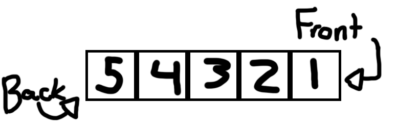

# Queues
## A. What It Is
Imagine you're going to the grocery store, and you bring with you your grocery list. As you're shopping, however, you find that if you're going through the list in order you end up backtracking, looping, and overall being ineffecient with how you're traveling around in the grocery store. So, next time you make your grocery list, you decide to order it in a way that keeps your movement in the grocery store effecient. This is how a queue works in Python!

A queue in Python is very similar to a list, except a queue has a specific order of how elements get into the list, and how they are taken out. Generally, a queue is treated as 'FIFO' -- that is, First In, First Out. If you've ever worked in the food industry, you know this acronym by heart as it's how most food is stocked and used to ensure that no food product goes to waste. Another way you may see a queue used in real life is in line at the DMV, or any place where you may have to wait in a line. In fact, in England, they call those lines 'queues'!
## B. How They Work
Lets generate a queue that we can use as an example. I'll explain later how you could make one in Python yourself.


For this example, we've enqueued 1, then 2, then 3, then 4, then 5. Since 1 is the oldest thing queued and hasn't been dequeued, that makes it the head. Since 5 is the most recent thing queued, that makes it the tail. Pretty simple, right? 

The following paragraphs demonstrate some of the more common methods of queues, but there are plenty more out there that I won't go through that could be added! Try to think of some by the end.
#### i. Enqueue + Dequeue
The main methods within a queue are the methods 'enqueue' and 'dequeue'. When entering a line, you don't cut to the front! At least, I hope you wouldn't. Instead, you enter in from the back. You `enqueue` at the back of the line, and `dequeue` once you get to the front. A simple Queue, as well as these methods, is provided below.
```python
class Simple_Queue:
    def __init__(self):
        """
        Initialize the empty queue using a Python List.  
        """
        self.queue = []

    def enqueue(self, value):
        """
        Enqueue the value provided into the queue
        """
        self.queue.insert(0, value)

    def dequeue(self):
        """
        Dequeue the next value and return it
        """
        value = self.queue[-1]
        del self.queue[-1]
        return value
```
Remember that if you're going to impliment any of this code to add error checks if the queue is empty!
You can, of course, use Python's in-house queues by simply `from queue import Queue`, but that's no fun.
#### ii. Front + Back
The `front` and the `back` are both locations in a queue. Pretty self explanatory, especially when you remember FIFO -- First In, First Out! As a note, sometimes people use `rear` instead of `back`.
## C. Performance
The operating performance of the previously mentioned methods.
|Name of Method|Description|Performance|
|:-:|:-:|:-:|
| enqueue(value)| Adds "value" to the back of the queue|O(1)|
|dequeue()|Removes and returns the item from the front of the queue|O(n) or O(1)[^1]|


## D. Examples
Building a queue from the code provided above, lets test and make sure everything runs smoothly. For example, lets queue something, dequeue it, and then print what gets dequeued to make sure everything runs smoothly.
```python
queue = Simple_Queue()
queue.enqueue(A)
value = queue.dequeue()
```
Running that code with our previously made queue prints the following:
```python
A
```
Which is exactly what we were hoping for.
Now, lets enqueue several things before we dequeue them. Running the following code:
```python
queue.enqueue(A)
queue.enqueue(B)
queue.enqueue(C)
value = queue.dequeue()
print(value)
value = queue.dequeue()
print(value)
value = queue.dequeue()
print(value)
```
Results in this printing out:
```python
A
B
C
```
Which is perfect! 

If you want to try and improve on this queue, maybe you can try adding a function that clears out the queue. Maybe make a function that can enqueue or dequeue multiple things at once. Or, maybe you can read out the queue in order, or store within the queue what item is in the front or in the back.

[Back to Welcome Page](0-welcome.md)
[^1]: Performance is only O(n) if the backing data structure is an array.
Other backing structures, such as linked lists, can return values more efficiently.
