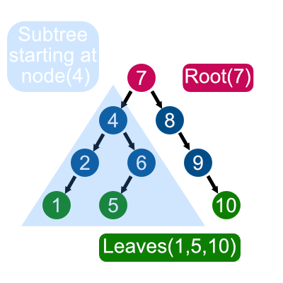
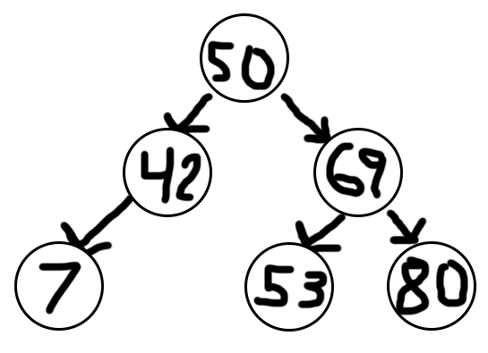
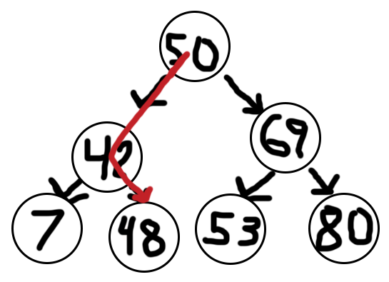
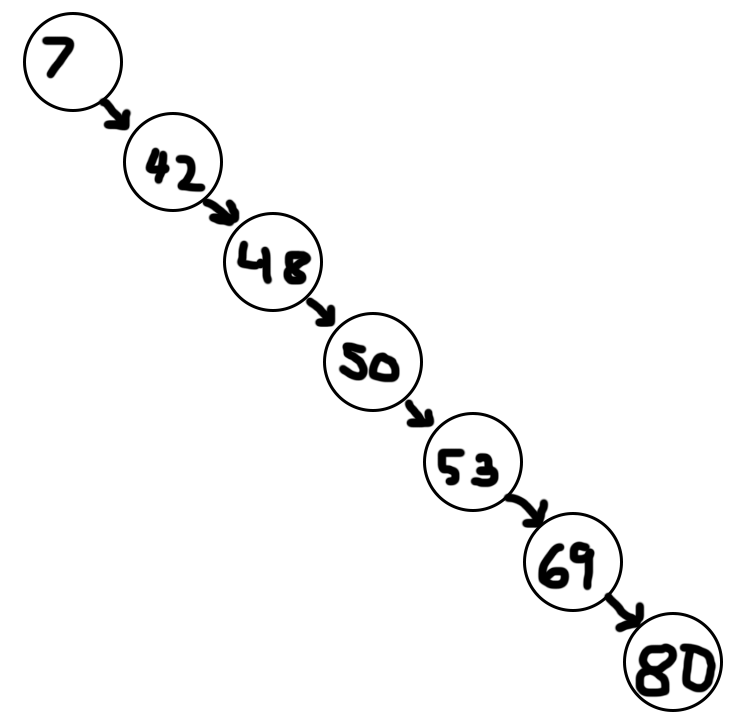

# Binary Search Trees
# Trees
## A. What It Is
A tree is a nonlinear data structure that unlike arrays, lists, linked lists, stacks or queues, (which are linear structures), is able to have multiple other nodes connected to the same node. The first node is always called the 'root', and all the nodes without a connection are called 'leaves'. Every node that has other nodes under it is called 'parent' and each dependant is a 'child'. Refer to the diagram below if you get lost in all the terminology!



We'll cover a few different types of trees: Binary Trees, Binary Search Tress and Balanced Binary Search Trees.

#### i. Binary Trees
A Binary Tree is a type of tree that only allows at most two nodes connected to a single node. Those are often called 'left child' and 'right child'. This type of trees are often used to implement binary search trees, and for efficient sorting or searching algorithms.
 
#### ii. Binary Search Trees
A binary search tree (BST), sometimes also known as an 'ordered' or 'sorted' binary tree, is a tree where new values are stored depending on whether they are larger or smaller than their parent node. The smallest values will be placed in or as the left child and the highest value will be placed in or as the right child. Having an structure like this is extremely efficient when it comes to sort a large collection of items. For example, let's insert the number 48 in the following tree.



To do so, we must follow the following steps:
1. Compare 48 and 50. Since 48 is less than 50 we keep looking at the left side of 50.
2. Compare 48 and 42. Since 48 is more than 42 we Look instead at the right of 42.
3. Since there is an empty spot we can insert 48 at the right side of 42.



As you can see, a BST is extremely efficient because inserting and find a specific value in a BST is done by excluding recursively a subtree, thus instead of performing a linear seach O(n) we reach an efficient O(log n).

But notice that our three is balanced, in other words each side has almost the same height. The Height of a tree is defined by the maximum number of sub-levels existing in a tree. (I'm sure you put that together, but it's good to clarify that sort of stuff.)

If we had the same numbers, but just happened to have entered them in order from smallest to largest, like so: 

7, 42, 48, 50, 53, 69, 80

Our  tree would look like lopsided, and all only be pointing to a right node, like this:


#### iii. Balanced Binary Search Trees

A Balanced Binary Search Tree is a BST which ensures that all the subtrees heights are the same, or at least as close to the same as possible.

In the visualization below, you can see how a balanced binary search tree is created from an array: taking the middle value of the array and setting it as the root, then taking the middle value of the remaining sides and setting that as the left node and right node, and so on until you are out of numbers.


It's credited in the bottom right corner, but shoutout to penjee for making such awesome gifs.

## B. How They Work

#### i. Recursion

Recursion is a technique used in programming to call a function within the same function. As a kid, did you ever call your mom using your dads phone, then face the two together as you spoke into them? That's sort of the same thing -- data is being called in a function over and over until a certain 'stopping point' that the programmer puts in to make sure we don't go infinitely.

Recursion and trees are good friends! Since everything with trees involves a lot of repitition, recursion is used often to keep us efficient. 

#### ii. Recursion Rules

When using recursion, you have to make sure you add a stop sign to tell the program when to stop looping on itself, otherwise...well, it doesn't.

The following two rules, used together, help keep programs that use recursion in check.

1. __Base Case__ - This is the 'stop sign'. The base case is the condition that stops the program from continuing to recurse.

2. __Smaller Problem__ - Programmers use a 'smaller problem' to provide a way for our program to reach the 'base case' *during* the recursive process.

Using a sample problem `print_n_numbers()`, let's implement a base case and a smaller problem.

 ```python
 def  print_n_numbers(n):
    if n < 0: # This is the base case. Once n goes below 0, the recursion stops.
        return
    else:
        print(n)
        print_n_numbers(n-1) # This is the smaller problem. 
                              #Every time recursion happens, n decreases by 1. 
                              #Eventually, we'll hit our base case.
 ```

## C. Performance
The efficiency of searching and adding to a BST is  O(log n), as seen in the table below. 
|Operation|Description|Performance|
|:-:|:-:|:-:|
|insert(value)|Insert a value into the tree|O(log n)|
|remove(value)|Remove a value from the tree|O(log n)|
|height(node)|Get the height of a node in the tree|O(log n)|
|contains(value)|Check if certain value is in the tree|O(log n)|
|traverse()|Pass through all the nodes in a tree in certain order|O(log n)|
If you're like me and you hated logarithms in math class, then no worries, it's actually pretty simple. With the BST we basically know the shortcut to get to the node we want. After each iteration of the search, the number of nodes we have to look through is divided by half!


For a visual representation, here's another gif from penjee to show how much quicker a BST is than just a standard sorted array.


That's taking such a small search from 10 steps down to only three! With much larger groups of numbers, the amount of efficiency gained cannot be overstated.
## D. Example

Here's the basis of a BST, written in Python and complete with a couple methods.

```python
class BST:
    def __init__(self):
        self.root = None

    class Node:
        def __init__(self, data):
            self.data = data
            self.left = None
            self.right = None

    def add(self, data):
        if self.root:
            self._add_recursive(self.root, data)
        else:
            self.root = BST.Node(data)

    def _add_recursive(self, node, data):
        if data < node.data:
            if node.left:
                self._add_recursive(node.left, data)
            else:
                node.left = BST.Node(data)

        elif data > node.data:
            if node.right:
                self._add_recursive(node.right, data)
            else:
                node.right = BST.Node(data)
```
Now, if we were to add a few numbers to tree, we can see the BST in action. In fact, why don't you try and chart out what the tree will look like by the time we're done?
Here's what I'll put in:
```python
bst = BST()
bst.add(25)
bst.add(2)
bst.add(34)
bst.add(16)
bst.add(47)
bst.add(51)
bst.add(7)
bst.add(16)
bst.add(22)
bst.add(34)
bst.add(42)
bst.add(8)
```
You'll notice that I added the number '34' twice. Luckily for us, our little `_add_recursive` method ensures that no duplicates are added by only checking for numbers that are either `>` or `<` the number we put in. Clever, huh?

If you want to try and improve on our little tree, maybe you can try to add a method that checks for a certain number by going down the branches. Maybe you could write a program that draws out what the tree looks like. Maybe you could write a method that takes an array and puts it on the tree so that the middle of the array is the main root of the BST! There's lots of ways that you can increase your knowledge and understanding of the trees. Maybe you'll find the Lorax as you do so?

[Back to Welcome Page](0-welcome.md)